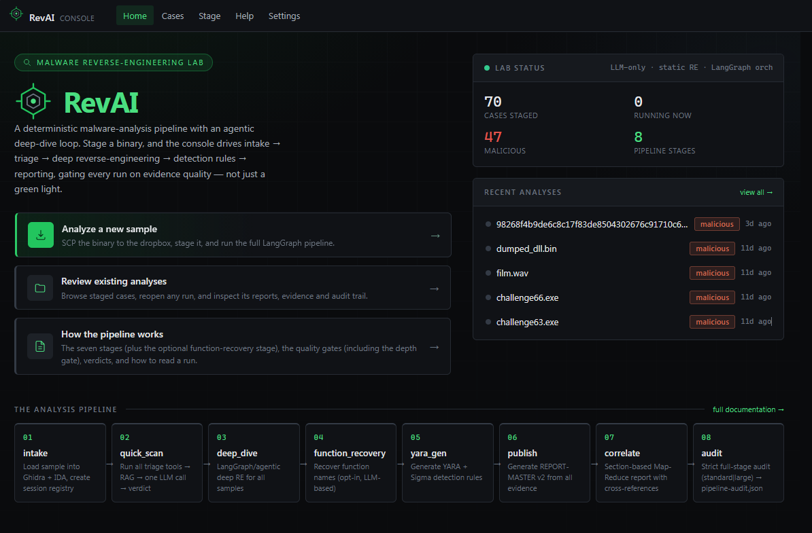
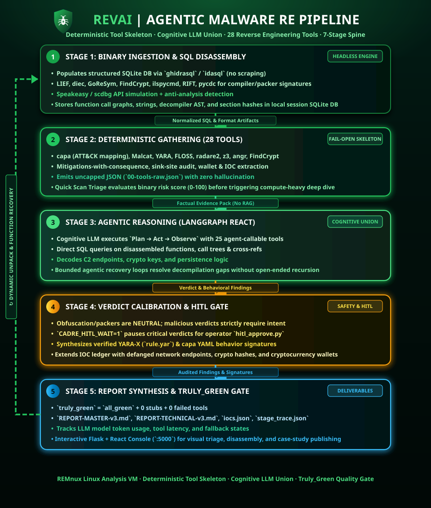
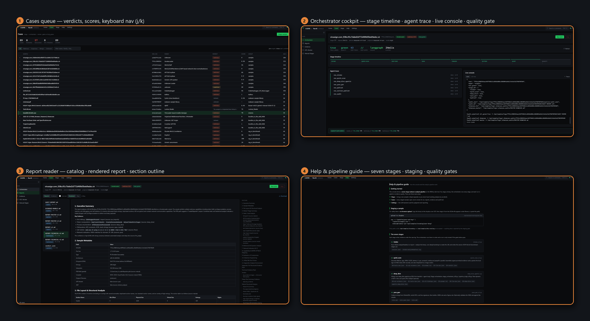

# CADRE-RevAI

<p align="center">
  
</p>

<p align="center">
  <a href="https://github.com/Ganron007/RevAI"></a>
  <a href="https://github.com/Ganron007/RevAI"></a>
  <a href="https://github.com/Ganron007/RevAI"></a>
  <a href="https://doi.org/10.5281/zenodo.21613150"></a>
</p>

> [!WARNING]
> **Malware Sandbox Containment.** CADRE-RevAI is an LLM-assisted malware reverse-engineering pipeline. Run it only inside an isolated analysis VM (REMnux recommended). The authors accept no liability for payload escapes or network contamination from improper containment.

---

## What is CADRE-RevAI?

**CADRE-RevAI** is an LLM-based malware reverse-engineering pipeline for REMnux:

- **LLM-based analysis** — RE tools produce a stage-tagged evidence pack; an OpenAI-compatible LLM writes the verdict and report.
- **Agentic deep dive** — a LangGraph ReAct planner drives SQL-first RE tools (Ghidra/IDA via ghidrasql/idasql, capa, Malcat, FLOSS, YARA, radare2, …) to collect structured evidence.
- **SQL-first RE** — Ghidra (required) and optional IDA Pro populate SQLite via **ghidrasql**/**idasql**; agents query structured evidence instead of scraping disassembly text.
- **Honest quality gate** — `report_quality.py` computes `truly_green = all_green (audit) + quality_green (no deterministic fallbacks / narrative stubs) + zero failed tools`. Every report carries a `source` (`llm_judge` vs `deterministic_fallback`), so a stubbed report can never look green.

---

### Published Research

> [!NOTE]
> **Why LLM-based and not RAG?**
>
> A retrieval-augmented generation configuration was built and empirically evaluated as part of this project. The study found that retrieval contamination degrades malware triage accuracy in RAG-assisted workflows; the published empirical evaluation and evidence-grounded baseline are available here:
>
> **Retrieval Contamination in LLM-Assisted Malware Triage: An Empirical Evaluation and an Evidence-Grounded Baseline** (2026)
> Zenodo · DOI [10.5281/zenodo.21613150](https://doi.org/10.5281/zenodo.21613150) · [zenodo.org/records/21613150](https://zenodo.org/records/21613150)

---

**Three ways to run the same pipeline:**

| Mode | Script | Stages | Deep Dive |
|------|--------|--------|-----------|
| **Scripted** | `pipeline_single.py` | Fixed order (intake -> quick_scan -> deep_dive -> yara_gen -> publish -> audit) | LangGraph agentic (always) |
| **Agentic** | `stage_orchestrator.py` | LLM decides which stage to call; retries on failure; HITL before publish if verdicts disagree | LangGraph agentic |
| **Web Console** | `http://<host>:5000` | User clicks individual stage buttons, or **Run orch** for full agentic | LangGraph agentic |

All three modes use the same tool stack and LLM backend — only the stage ordering differs:

- **Static analysis** — Ghidra, radare2, capa, YARA, FLOSS
- **Dynamic / emulation** — Speakeasy, scdbg
- **Deobfuscation / symbolic** — z3, angr
- **Format-specific** — LIEF, diec, GoReSym, FindCrypt, ilspycmd, RIFT, pycdc

The deep dive always runs through the LangGraph ReAct agent. See [`docs/case-studies/`](docs/case-studies/) for real analysis reports and [`docs/OPERATE.md`](docs/OPERATE.md) for usage details.

<p align="center">
  
</p>

> **Reality check.** CADRE-RevAI is an analyst assistant, not a finished autonomous product. A green stage means the tooling and quality gate passed — it is **not** a guarantee that the analysis is malware-analyst-accurate. Always review the evidence and the report.

---

## Architecture

RevAI runs as a local service on REMnux. The Flask app (`app.py`) serves the React Console and drives the stage scripts under `/opt/scripts/`. Ghidra (required) and optional IDA Pro / Malcat feed structured SQL evidence into the agentic deep dive, and the LLM authors the verdict and report from the evidence pack. The quality gate (`report_quality.py`) decides `truly_green`.

<p align="center">
  
</p>

---

## Pipeline

The spine runs seven stages. Orchestration is either the **LangGraph ReAct orchestrator** (`stage_orchestrator.py`, which plans/executes the whole spine — this is what the Console's **Run orch** button drives) or the **deterministic single-mode spine** (`pipeline_single.py`).

```
React Console / CLI
   │
   │  stage_orchestrator.py  (LangGraph ReAct: plan → act → observe)
   │     OR pipeline_single.py (deterministic spine)
   │
   ├─ 1. intake_v2.py            session + Ghidra (optional IDA) → SQLite
   ├─ 2. quick_scan_v2.py        triage tools → evidence-pack → LLM verdict
   ├─ 3. deep_dive_agentic.py    AGENTIC LangGraph ReAct deep dive
   │        (planner agent drives Ghidra/IDA SQL, capa, Malcat, FLOSS, YARA, r2)
   ├─ 4. yara_gen_v2.py          YARA + Sigma generation
   ├─ 5. publish_report_v2.py    REPORT-MASTER (LLM-authored, source-tagged)
   ├─ 6. section_publisher.py    correlate — section Map-Reduce report
   └─ 7. audit_pipeline.py       all_green per-stage audit
            │
            └─ report_quality.py → truly_green quality gate
```

**Verdict generation:** tools → `package_stage_evidence` → LLM. The LLM writes the verdict and report from the stage-tagged evidence pack.

---

## Feature Matrix

| Capability | Default |
| :--- | :--- |
| Static triage (capa, YARA, FLOSS, Malcat, …) | On |
| Agentic deep dive (`deep_dive_agentic`, LangGraph ReAct) | On |
| YARA / Sigma generation | On |
| Master report publish (LLM-authored, source-tagged) | On |
| Section correlate / Map-Reduce report | On |
| Pipeline audit + `truly_green` quality gate | On |
| HITL annotate / review gates | Available |
| Orchestrator (LangGraph ReAct) **or** deterministic spine | Both available |

---

## Showcase

**The Console in use** — (1) the cases queue with verdicts and keyboard nav, (2) the orchestrator cockpit (stage timeline, agent trace, live console, quality-gate bar), (3) the report reader with catalog and section outline, (4) the in-app help & pipeline guide:

<p align="center">
  
</p>

The emerald/dark "Obsidian Ops" Console provides a case queue, an orchestrator command center (stage timeline + agent trace + live log + quality-gate bar), a report reader with TOC, an evidence browser, HITL review, and help.

---

## Requirements

* **OS**: REMnux (Ubuntu 24.04-based) or equivalent isolated Linux analysis VM  
* **Resources**: 8 GB RAM minimum (16 GB recommended); ≥100 GB disk  
* **LLM**: Any OpenAI-compatible chat API (`config/llm.env.template` → `/opt/cadre-v3-tools/llm.env`)  
* **Ghidra + ghidrasql + Malcat**: see [`docs/PREREQUISITES.md`](docs/PREREQUISITES.md)  
* **Optional**: IDA Pro 9.x at `/opt/ida` (otherwise Ghidra-only)  
* **Node.js ≥ 18**: to build the React Console UI (`scripts/deploy.sh` builds it via npm)  

---

## Quickstart

### 1. Clone & install

```bash
git clone https://github.com/Ganron007/RevAI.git
cd CADRE-RevAI
sudo chmod +x install/*.sh scripts/deploy.sh
sudo ./install/setup-remnux.sh
```

Setup installs Python deps, normalizes Ghidra to `/opt/ghidra`, and builds **ghidrasql**.  
**Malcat** is commercial — install manually to `/opt/malcat` (see prerequisites).

### 2. Configure LLM (required)

```bash
sudo cp config/llm.env.template /opt/cadre-v3-tools/llm.env
sudo nano /opt/cadre-v3-tools/llm.env
```

### 3. Deploy pipeline + React Console

```bash
./scripts/deploy.sh --restart
```

`deploy.sh` copies the pipeline to `/opt/scripts/`, **builds the React Console UI via npm and deploys it to `/opt/scripts/ui`**, installs the systemd service, and restarts `revai`.

Open `http://localhost:5000` (or the REMnux lab IP).

### 4. Verify & smoke

```bash
./install/verify-remnux.sh
python3 /opt/scripts/v2_validate.py --smoke-only
```

Expected: verify `Result: PASS` and `V2_SMOKE_OK` (preflight — no malware sample required).

Full ops: [`docs/OPERATE.md`](docs/OPERATE.md) · Install: [`docs/INSTALL.md`](docs/INSTALL.md) · Prerequisites: [`docs/PREREQUISITES.md`](docs/PREREQUISITES.md).

---

## Tool Stack (24 tools)

The pipeline runs 24 tools automatically via `TOOL_MANIFEST`, plus 19 agent-callable tools in the deep dive `ToolRegistry`:

**Core tools:**
Ghidra (SQL-first) · IDA Pro (optional) · Malcat (native capa engine + MCP analysis) · capa (Mandiant fallback) · FLOSS · YARA · radare2 · Speakeasy · Frida · oletools · pefile/lief · z3 · angr

**Extended tools:**
LIEF (binary structure) · diec (packer/compiler/language ID) · GoReSym (Go symbol recovery) · FindCrypt (crypto constant detection) · ilspycmd (.NET C# decompile) · RIFT (Rust metadata) · pycdc (Python bytecode) · pdfid (PDF analysis) · scdbg (shellcode emulation) · ELF structural analysis · signature matching (crypto/stdlib/winapi)

**Agent-callable tools:**
ghidra_query · ida_query · ghidra_decompile · signature_match · z3_solve · angr_analyze

See [`docs/OPERATE.md`](docs/OPERATE.md) for per-tool details.

---

## Why Malcat's capa engine?

Capability detection (capa) is the backbone of triage. The pipeline uses **Malcat's native capa engine** (`malcat.capa.py`) as the primary capability detector, with Mandiant capa as fallback — not the other way around. This is backed by a measured 10-sample benchmark on real malware:

| # | Size | Malcat | Mandiant capa | capa-rs |
|---|------|--------|---------------|---------|
| 0 | 0.03 MB | 41r / 0.95s | 42r / 0.62s | 22r / 0.33s |
| 1 | 0.12 MB | 95r / 1.16s | 104r / 22.2s | FAIL (SMDA) |
| 2 | 0.33 MB | 45r / 1.05s | 51r / 9.9s | FAIL |
| 3 | 0.53 MB | 87r / 1.88s | 96r / 80.5s | FAIL |
| 4 | 1.38 MB | 15r / 1.37s | 18r / 29.0s | 8r / 4.8s |
| 5 | 2.36 MB | 9r / 1.37s | 11r / 22.1s | FAIL |
| 6 | 3.12 MB | **101r / 5.0s** | FAIL / 300s TIMEOUT | FAIL |
| 7 | 3.56 MB | 81r / 3.8s | 90r / 145s | FAIL |
| 8 | 5.02 MB | **17r / 3.0s** | FAIL / 300s TIMEOUT | FAIL |
| 9 | 8.01 MB | **22r / 6.7s** | FAIL / 300s TIMEOUT | FAIL |

**Verdict:**

| Metric | Winner |
|--------|--------|
| **Speed** | **Malcat** — ~1–7s on all 10 samples; Mandiant 0.6–145s when it finishes, 3/10 timeout at 300s |
| **Reliability** | **Malcat** — 10/10 OK; Mandiant 7/10; capa-rs 2/10 (SMDA/parse failures) |
| **Rule count (when Mandiant completes)** | Mandiant slightly richer (~+5–10%) — different extractors, not identical corpora |
| **Usable signal on hard samples (#6/#8/#9)** | **Malcat only** |

Malcat's engine is a native compiled scanner: it never times out on large, obfuscated, or installer-packed binaries (Inno Setup, NSIS, packers) that stall the stock Mandiant Python engine. This keeps the quality gate green on hard samples instead of falling back to stubs. Mandiant capa remains available as a fallback via `CADRE_CAPA_ENGINE=malcat|capa-rs|capa`.

> **Malcat is optional — recommended, never required.** It is a commercial tool, and we respect that not everyone can use it. Without Malcat the pipeline **soft-fails** gracefully: capa falls back to Mandiant, Malcat triage sections are reported as unavailable, and the quality gate stays honest (soft-failure, not green). Install notes: `docs/PREREQUISITES.md` → "Recommended (optional): Malcat". `install/setup-remnux.sh` auto-installs it if the archive is present at `internal/malcat.zip`, and skips with a warning otherwise.

---

## Security Guidelines

* Keep the VM network isolated (host-only / lab NIC).  
* Never commit `.env` files, API keys, or malware samples.  
* The React Console / Flask app is intended for trusted LAN use — do not expose it to the public internet without additional hardening.  

---

## License

MIT — see [LICENSE](LICENSE).

> Copyright (c) 2026 CADRE RE Team.
