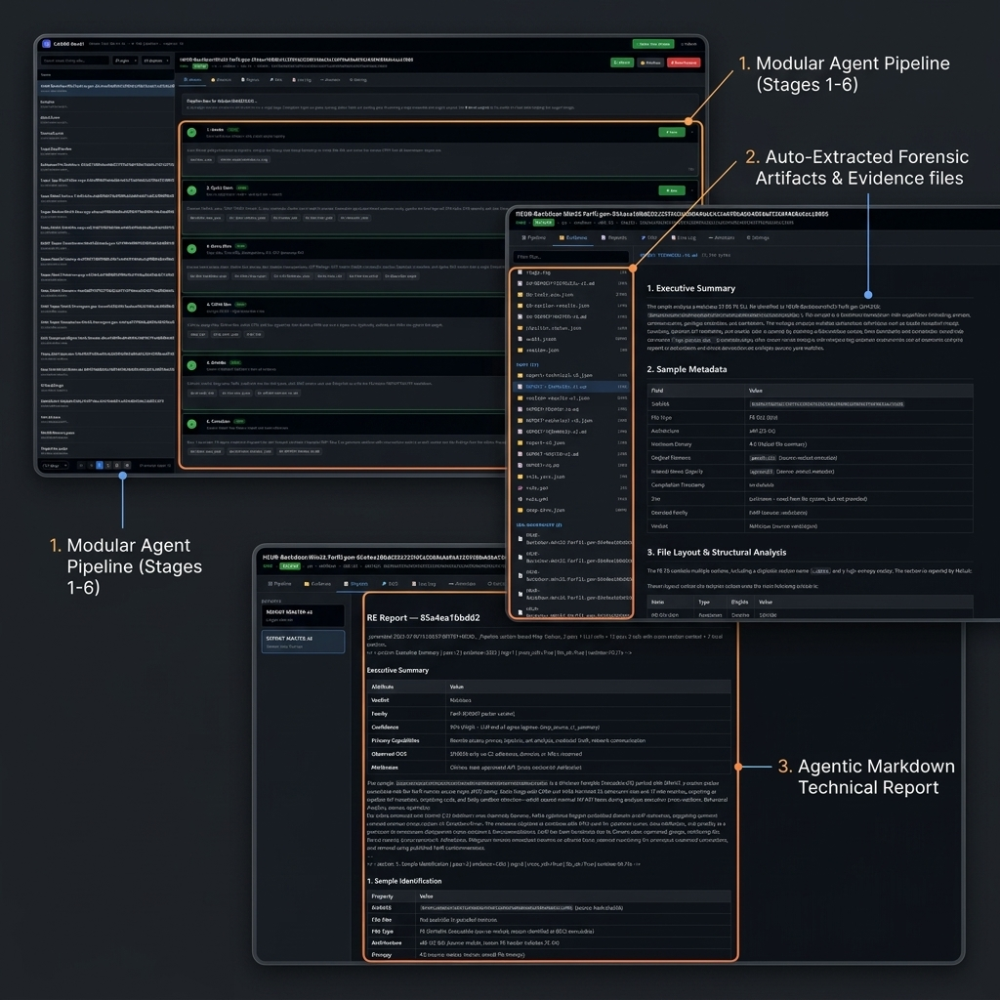

# CADRE-RevAI

<p align="center">
  
</p>

<p align="center">
  <a href="https://github.com/CADRE-Platform/CADRE-RevAI"></a>
  <a href="https://github.com/CADRE-Platform/CADRE-RevAI"></a>
  <a href="https://github.com/CADRE-Platform/CADRE-RevAI"></a>
</p>

> [!WARNING]
> **Malware Sandbox Containment.** CADRE-RevAI is an LLM-assisted malware reverse-engineering pipeline. Run it only inside an isolated analysis VM (REMnux recommended). The authors accept no liability for payload escapes or network contamination from improper containment.

---

## What is CADRE-RevAI?

**CADRE-RevAI** is a malware reverse-engineering pipeline for REMnux:

- **LLM-only by default** — triage tools produce a stage-tagged evidence pack; an OpenAI-compatible LLM writes the verdict/report. **No RAG / KB retrieval unless you opt in.**
- **Standard vs large** — smaller samples use `deep_dive_v2.py`; larger samples use `deep_dive_agentic.py` (checklist + agent loop).
- **SQL-first RE** — Ghidra (and optional IDA Pro) populate SQLite via **ghidrasql**; stages query structured evidence.

---

## Pipeline (5-script spine)

```
Flask UI / CLI
   │
   ├─ 1. intake_v2.py
   ├─ 2. quick_scan_v2.py          (tools → evidence-pack → LLM verdict)
   ├─ 3. deep_dive_v2.py           (standard)
   │     OR deep_dive_agentic.py   (large)
   ├─ 4. yara_gen_v2.py
   └─ 5. publish_report_v2.py
         (+ section_publisher.py correlate, audit_pipeline.py)
```

**LLM-only means:** tools → `package_stage_evidence` (`rag=off`) → LLM.  
Opt-in RAG: Flask **Settings → Enable RAG** or `REVENG_RAG=1`.

---

## Architecture

RevAI runs as a local service on REMnux. The Flask UI drives stage scripts under `/opt/scripts/`. Ghidra (and optional IDA Pro / Malcat) feed structured evidence into the LLM path.


---

## Feature Matrix

| Capability | Default |
| :--- | :--- |
| Static triage (capa, YARA, FLOSS, Malcat, …) | On |
| Standard deep dive (`deep_dive_v2`) | On (auto for smaller samples) |
| Large agentic deep (`deep_dive_agentic`) | On (auto for large/complex samples) |
| YARA / Sigma generation | On |
| Master report publish | On |
| HITL annotate gates | Available |
| **RAG / local KB** | **Off** (opt-in) |

Optional research extras (Z3/angr deobfuscation, experimental recovery) remain under `revai/deobfuscation/` and `revai/v4/` — not required to run the spine.

---

## Showcase

<p align="center">
  
</p>

---

## Requirements

* **OS**: REMnux (Ubuntu 24.04-based) or equivalent isolated Linux analysis VM  
* **Resources**: 8 GB RAM minimum (16 GB recommended); ≥100 GB disk  
* **LLM**: Any OpenAI-compatible chat API (`config/llm.env.template` → `/opt/cadre-v3-tools/llm.env`)  
* **Ghidra + ghidrasql + Malcat**: see [`docs/PREREQUISITES.md`](docs/PREREQUISITES.md)  
* **Optional**: IDA Pro 9.x at `/opt/ida` (otherwise Ghidra-only)  
* **Optional**: FastAPI embed/rerank service **only if** you enable RAG  

---

## Quickstart

### 1. Clone & install

```bash
git clone https://github.com/CADRE-Platform/CADRE-RevAI.git
cd CADRE-RevAI
sudo chmod +x install/*.sh scripts/deploy.sh
sudo ./install/setup-remnux.sh
```

Setup installs Python deps, normalizes Ghidra to `/opt/ghidra`, and builds **ghidrasql**.  
**Malcat** is commercial — install manually to `/opt/malcat` (see prerequisites).

### 2. Configure LLM (required)

```bash
sudo cp config/llm.env.template /opt/cadre-v3-tools/llm.env
sudo nano /opt/cadre-v3-tools/llm.env
```

RAG config is **optional**. Defaults keep `REVENG_RAG=0`. Only copy `config/rag.env.template` if you intend to opt in.

### 3. Deploy UI

```bash
./scripts/deploy.sh --restart
```

Open `http://localhost:5000` (or the REMnux lab IP).

### 4. Verify & smoke

```bash
./install/verify-remnux.sh
python3 /opt/scripts/v2_validate.py --smoke-only
```

Expected: verify `Result: PASS` and `V2_SMOKE_OK` (preflight — no malware sample required).

Full ops: [`docs/OPERATE.md`](docs/OPERATE.md) · Install: [`docs/INSTALL.md`](docs/INSTALL.md) · Prerequisites: [`docs/PREREQUISITES.md`](docs/PREREQUISITES.md).

---

## Security Guidelines

* Keep the VM network isolated (host-only / lab NIC).  
* Never commit `.env` files, API keys, or malware samples.  

---

## License

MIT — see [LICENSE](LICENSE).

> Copyright (c) 2026 RevAI contributors.
