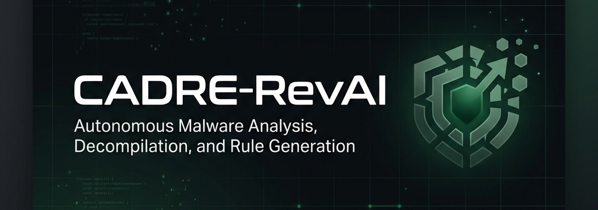

# CADRE-RevAI

<p align="center">
  
</p>

<p align="center">
  <strong>Autonomous Malware Reverse Engineering, Decompilation, and Rule Generation</strong>
</p>

<p align="center">
  <a href="https://github.com/AppliedIR/remnux-mcp"></a>
  <a href="https://github.com/AppliedIR/remnux-mcp"></a>
  <a href="https://github.com/AppliedIR/remnux-mcp"></a>
</p>

---

## What is CADRE-RevAI?

**CADRE-RevAI** is the specialized reverse-engineering pipeline of the CADRE platform. Running as a self-contained analysis suite on a single **REMnux VM**, it automates the triage, decompilation, deobfuscation, and rule generation process for Windows PE and Linux ELF binaries. 

It orchestrates advanced static parsing, emulator-based behavioral analysis, LLM-driven verdict synthesis, and symbolic code recovery into a unified browser-based workspace.

---

## Core Capabilities

| Capability | Feature Set |
| :--- | :--- |
| **Intelligent Triage** | Automated file-type detection, YARA-X scanning, Capa capability mapping, Malcat heuristic extraction, and LLM-assisted verdicts. |
| **Deep Dive Decompilation** | Ghidra SQL-first decompilation paired with optional commercial IDA SQL integration. Speakeasy emulation tracks behavior, API calls, and memory regions. |
| **Rule Auto-Generation** | Automatically extracts indicators and decompiled patterns to generate optimized YARA-X and Sigma rules, featuring goodware false-positive filters. |
| **Symbolic Deobfuscation** | MBA (Mixed Boolean-Arithmetic) simplification via Z3 solvers, opaque predicate cracking, and GhidraScript Control Flow Flattening (CFF) deflattening. |
| **RAG Retrieval** | Hybrid BM25 + dense neural search over local malware intelligence corpuses via a unified FastAPI embedding service. |
| **HITL Checkpoints** | Human-in-the-Loop approval gates triggered for low-confidence verdicts, function renaming validation, and report publishing. |
| **Function Recovery** | Agentic reconstruction of decompiled functions, matching control-flow graphs (CFGs) against signatures, and automated function renaming. |

---

## Architecture & Data Flow

CADRE-RevAI runs on a single REMnux VM. The browser-based Flask UI drives the pipeline, while optional commercial add-ons (IDA Pro, Malcat) and external RAG/LLM services plug in via environment variables.


## Directory Layout

* 📁 **`revai/`**: Core reverse engineering package containing intake, triage, decompilation, and Flask template files.
* 📁 **`install/`**: Setup scripts (`setup-remnux.sh`, `verify-remnux.sh`) and daemon templates (`revai.service`).
* 📁 **`config/`**: Configuration templates for local LLMs and embeddings/RAG parameters.
* 📁 **`docs/`**: Operational, deployment, and configuration guides.
* 📁 **`tests/`**: Integration and regression validation tests.

---

## User Interface

The Flask UI exposes a clean, single-pane browser-based workspace to upload binaries, monitor execution stages in real-time, inspect decompiled sources, and review generated signatures.

<p align="center">
  
</p>

---

## Quickstart

### 1. VM Installation
Launch a REMnux virtual machine (or Ubuntu 24.04 instance with REMnux tools) and run the setup installer:

```bash
sudo ./install/setup-remnux.sh
```

### 2. Environment Configuration
Copy templates and configure API keys for your LLM and RAG servers:

```bash
sudo cp config/llm.env.template /opt/cadre-v3-tools/llm.env
sudo cp config/rag.env.template /opt/cadre-v3-tools/rag.env

sudo nano /opt/cadre-v3-tools/llm.env
sudo nano /opt/cadre-v3-tools/rag.env
```

### 3. Build & Deploy
Compile assets and start the service daemon:

```bash
./scripts/deploy.sh --restart
```

Access the browser interface locally at `http://localhost:5000`.

### 4. Verification Check
Run the regression validation suite to verify the intake pipeline:

```bash
python3 /opt/scripts/v2_validate.py --smoke-only
```
Expected output: `V2_SMOKE_OK`.

---

## Security Guidelines

Keep your analysis environment secure:
* **No Secret Commits:** Do not commit API keys, tokens, or live malware binaries to Git. Environment variables (`llm.env`, `rag.env`) and local samples are pre-excluded in `.gitignore`.
* **Isolated Sandbox:** Ensure REMnux VM networking is properly segmented when analyzing hostile samples.

---

## License

Distributed under the MIT License. See [LICENSE](LICENSE) for details.