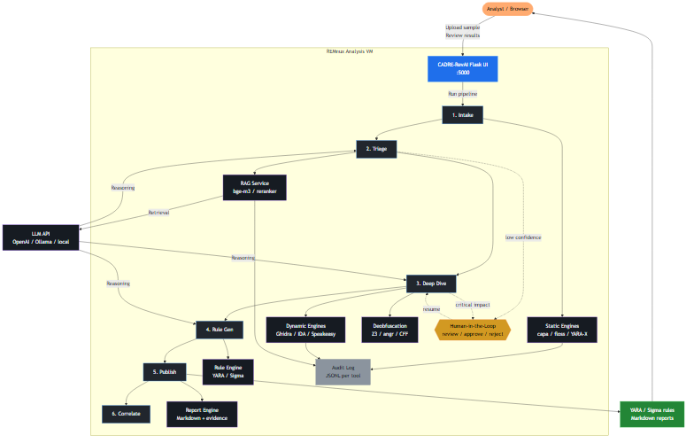
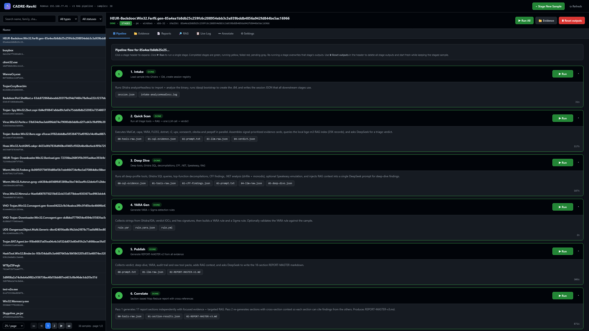

# CADRE-RevAI

CADRE-RevAI is the malware reverse-engineering arm of the CADRE platform. It runs as a self-contained autonomous-analysis pipeline on a single REMnux analysis VM, combining LLM agents, hybrid RAG retrieval, and deobfuscation to triage, decompile, and generate YARA/Sigma rules for Windows PE samples — all driven through a browser-based UI.

## What it does

- **Triage** — file-type identification, YARA/capa/imports/strings analysis, LLM verdict.
- **Deep Dive** — Ghidra SQL-first decompilation, optional IDA SQL, Speakeasy emulation, behavioral extraction.
- **Rule Generation** — YARA + Sigma rules with false-positive control.
- **Reporting** — Markdown reports (executive and technical) with evidence tables.
- **RAG** — hybrid BM25 + dense retrieval over a malware-knowledge corpus via a unified FastAPI embedding service.
- **Deobfuscation** — Z3 MBA simplification, angr symbolic execution, CFF detection/deflatten.
- **HITL** — human-in-the-loop approval gates for high-confidence decisions.
- **Agentic Recovery (optional)** — call-graph-ordered function recovery between deep dive and report publishing.

## Repository layout

```text
CADRE-RevAI/
├── revai/              # Core pipeline package (deploys to /opt/scripts/)
│   ├── app.py          # Flask UI
│   ├── v2_lib.py       # Shared analysis library
│   ├── intake_v2.py    # Sample intake
│   ├── quick_scan_v2.py # Triage
│   ├── deep_dive_v2.py # Deep analysis
│   ├── yara_gen_v2.py  # Rule generation
│   ├── publish_report_v2.py  # Markdown report generator
│   ├── section_publisher.py   # Per-section report publisher
│   ├── v2_validate.py  # Smoke / regression validation
│   ├── ui/templates/   # Flask UI templates
│   ├── mcp-*/          # MCP servers (capa, floss, malcat, yara, decompile)
│   ├── rag/            # RAG searchers and embedder client
│   ├── deobfuscation/  # Z3/angr/CFF helpers
│   ├── cff-deflatten/  # GhidraScript CFF deflatten
│   ├── hitl/           # HITL checkpoint helpers
│   ├── v4/             # Optional agentic function recovery (deploys to /opt/cadre-v4-tools/)
│   └── ...             # Staging and maintenance scripts
├── install/            # setup-remnux.sh, verify-remnux.sh, revai.service
├── config/             # Environment templates (no secrets)
├── scripts/            # deploy.sh
├── docs/               # Installation, configuration, and operation guides
├── tests/              # Smoke and regression tests
└── README.md
```

## Architecture, tools & techniques

CADRE-RevAI runs on a single REMnux VM. The browser-based Flask UI drives the pipeline, while optional commercial add-ons (IDA Pro, Malcat) and external RAG/LLM services plug in via environment variables.



*Source diagram: [`docs/img/revai-architecture.mmd`](docs/img/revai-architecture.mmd)*

### Techniques by category

- **Static Analysis** — PE/ELF parsing, capa rule mapping, YARA-X scanning, FLOSS strings, import tables, entropy/section analysis.
- **Dynamic / Behavioral** — Speakeasy emulation, Frida static probes, memory forensics, document macro analysis.
- **Deobfuscation** — Z3 MBA simplification, opaque predicate solving, angr symbolic execution, CFF detection/deflatten.
- **RAG / Retrieval** — BM25 + dense hybrid, RRF fusion, bge-m3 embeddings, bge-reranker reranking, FAISS HNSW ANN (optional).
- **Rule Generation** — YARA string extraction, Sigma rule building, goodware false-positive check, rule validation.
- **Human-in-the-Loop** — confidence < 50 review, critical-impact tags, approve/reject gates, audit trail.
- **Agentic Recovery** — call-graph ordered analysis, signature matching, LLM synthesis, function renaming.

### Documentation map

- [`docs/INSTALL.md`](docs/INSTALL.md) — full dependency install on REMnux.
- [`docs/DEPLOY.md`](docs/DEPLOY.md) — deploy pipeline, configure env files, start service.
- [`docs/CONFIGURE.md`](docs/CONFIGURE.md) — LLM/RAG/IDA env variables.
- [`docs/OPERATE.md`](docs/OPERATE.md) — day-to-day: staging samples, running stages, tests.
- `revai/deobfuscation/README.md` — Z3/angr/CFF usage.
- `revai/hitl/README.md` — HITL gates and API endpoints.
- `revai/v4/v4-agentic-recovery-addendum.md` — optional agentic recovery design.
- `revai/regression/README.md` — baseline regression samples.

## Screenshot

The Flask UI runs on `:5000` and is branded CADRE-RevAI end-to-end:



## Quick start

1. Install a REMnux 202602 VM (or equivalent Ubuntu 24.04 + REMnux tooling).
2. Clone this repo and run the setup script:
   ```bash
   sudo ./install/setup-remnux.sh
   ```
3. Configure your LLM and RAG endpoints:
   ```bash
   sudo cp config/llm.env.template /opt/cadre-v3-tools/llm.env
   sudo cp config/rag.env.template /opt/cadre-v3-tools/rag.env
   sudo nano /opt/cadre-v3-tools/llm.env
   sudo nano /opt/cadre-v3-tools/rag.env
   ```
4. Deploy the pipeline:
   ```bash
   ./scripts/deploy.sh --restart
   ```
5. Open the UI at `http://<remnux-ip>:5000`.
6. Verify:
   ```bash
   python3 /opt/scripts/v2_validate.py --smoke-only
   ```
   Expected output: `V2_SMOKE_OK`.

See [`docs/INSTALL.md`](docs/INSTALL.md) for the full setup and [`docs/OPERATE.md`](docs/OPERATE.md) for day-to-day use.


## Optional: IDA Pro

If you have a licensed IDA Pro 9.3 for Linux installed at `/opt/ida` with `idasql` on `PATH`, the pipeline will use it alongside Ghidra. If IDA is absent, the pipeline falls back to Ghidra SQL only.

## Status

The v2/v3 pipeline is verified end-to-end on REMnux. The v4 agentic function-recovery stage is included as an optional preview, gated by `ENABLE_AGENTIC_RECOVERY=1`.

## License

MIT — see [LICENSE](LICENSE).

## Security

Do not commit API keys, secrets, or malware samples to this repository. Keep `llm.env`, `rag.env`, and any runtime data out of git. The `.gitignore` file already excludes common secret and output paths.