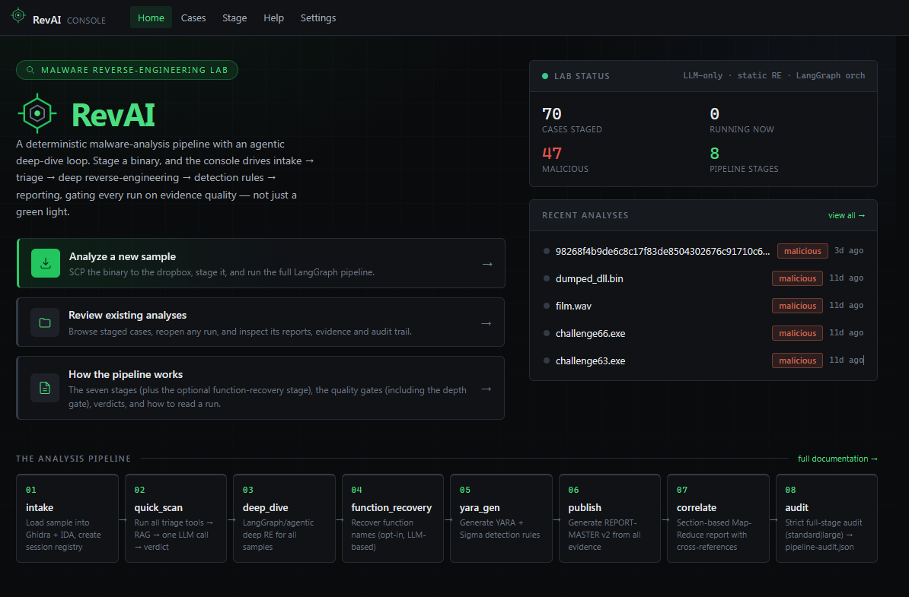
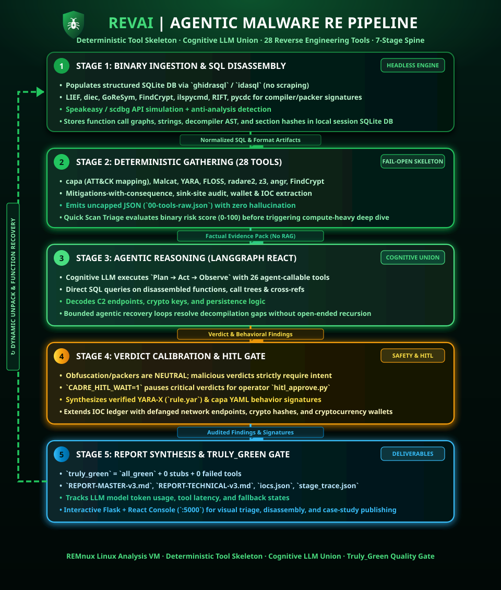

# RevAI

<p align="center">
  
</p>

<p align="center">
  <a href="https://github.com/Ganron007/RevAI"></a>
  <a href="https://github.com/Ganron007/RevAI"></a>
  <a href="https://github.com/Ganron007/RevAI"></a>
  <a href="https://doi.org/10.5281/zenodo.21613150"></a>
</p>

> **Malware Sandbox Containment.** RevAI is an LLM-assisted malware reverse-engineering pipeline. Run it only inside an isolated analysis VM (REMnux recommended). The authors accept no liability for payload escapes or network contamination from improper containment.

---

## What is RevAI?

**RevAI** is an LLM-assisted malware reverse-engineering pipeline for REMnux. It is **deterministic-first**: format-aware RE tools run deterministically and produce the evidence; the LLM interprets that evidence into verdicts and reports — never the other way around:

- **Deterministic-first analysis** — RE tools produce a stage-tagged evidence pack; an OpenAI-compatible LLM interprets the evidence into the verdict and report. Everything the LLM can claim must trace back to real tool output.
- **Agentic deep dive** — a LangGraph ReAct agent searches SQL-first RE tools (Ghidra/IDA via ghidrasql/idasql, capa, Malcat, FLOSS, YARA, radare2, …) on top of a deterministic checklist and signal extractors (emulation oracle, anti-analysis, dynamic-resolve, unpack pass) that run first.
- **SQL-first RE** — Ghidra (required) and optional IDA Pro populate SQLite via **ghidrasql**/**idasql**; the agent queries structured evidence instead of scraping disassembly text.
- **Honest quality gate** — `report_quality.py` computes `truly_green = all_green (audit) + quality_green (no deterministic fallbacks / narrative stubs) + zero failed tools`. Every report carries a `source` (`llm_judge` vs `deterministic_fallback`), so a stubbed report can never look green.

**Optional dynamic companion — [WinRE](https://github.com/Ganron007/WinRE).** RevAI is static-first; when live behaviour is needed, WinRE detonates the sample on an isolated FlareVM and returns a versioned artifact pack that RevAI reads for corroboration. Reports gain a presence-gated *Dynamic Corroboration* section when a pack exists, and are unchanged when one does not. Dynamic evidence corroborates static findings — it never overrides them. Setup and triggers: [`docs/WINRE-REMOTE.md`](docs/WINRE-REMOTE.md).

> **Reality check.** RevAI is an analyst assistant, not a finished autonomous product. LLM-assisted analysis is inherently probabilistic: results can vary between runs, and a green stage means the tooling and quality gate passed — **not** that the analysis is malware-analyst-accurate or the verdict objectively correct. Models can misread evidence, and tool limits (packing, obfuscation, emulation) leave gaps the gates cannot fully close. Always review the evidence and the report — treat it as a starting point for analyst review, never as ground truth.

---

### Published Research

> [!NOTE]
> **Why LLM interpretation and not RAG?**
>
> A retrieval-augmented generation configuration was built and empirically evaluated as part of the parent research project (RevEng) from which RevAI is derived. The study found that retrieval contamination degrades malware triage accuracy in RAG-assisted workflows; the published empirical evaluation and evidence-grounded baseline are available here:
>
> **Retrieval Contamination in LLM-Assisted Malware Triage: An Empirical Evaluation and an Evidence-Grounded Baseline** (2026)
> Zenodo · DOI [10.5281/zenodo.21613150](https://doi.org/10.5281/zenodo.21613150) · [zenodo.org/records/21613150](https://zenodo.org/records/21613150)

---

## The Console

RevAI runs as a local service on REMnux. The Flask app (`app.py`) serves the
React Console and drives the stage scripts under `/opt/scripts/`.

<p align="center">
  
</p>

The Console is a control surface, not a separate pipeline: every stage runs the
same script the CLI runs, with the same tools and the same gates. What it adds is
being able to drive a run stage by stage, watch it live, and read the artifacts
without leaving the browser — running the whole spine with the **Run orch**
button, inspecting verdicts and reports per case, configuring the optional WinRE
detonation, and recording analyst direction.

**Everything the CLI can do is reachable from the Console and vice versa** — that
parity is a design rule, not an accident. Environment gates an operator would
think of as a feature (depth mode, TI enrichment, the depth ceiling, the IoC
fact-check's mode) are settable from both, and a test fails if a new gate
becomes reachable from only one. See
[`docs/OPERATE.md`](docs/OPERATE.md) for the Console field by field.

---

## Three ways to run the pipeline

All modes run the same stage scripts, the same tool stack, and the same LLM backend. The difference between modes is *who decides the sequence* and *how failures are handled* — the stage list itself is in [Pipeline](#pipeline) below:

| Mode | Script / Entry | Stage Sequencing | Failure Handling |
| :--- | :--- | :--- | :--- |
| **Scripted** *(default)* | `pipeline_single.py` | • Deterministic fixed order (the spine below)<br>• No LLM orchestration | **Zero retries**<br>Failed stage aborts remaining pipeline (predictable, deterministic runtime). |
| **Agentic** | `stage_orchestrator.py` | • LangGraph ReAct planner (LLM) in policy-pinned order<br>• Observes verdicts/evidence between stages<br>• HITL stop before publish if quick/deep verdicts disagree | **1 bounded retry** *(default)*<br>Handles transient failures (timeouts, connection loss, OOM). Calibrated via `REVAI_*` env / console panel (retries, budget, recursion limit, timeout scale). |
| **Web Console** | `http://<host>:5000` | • Manual stage buttons (human-paced)<br>• **Run orch** button (full agentic path)<br>• **Analyst steering** — pre-run note (`REVAI_STEERING_FILE`), or a post-hoc note via `/api/steer/<sha>` for the next run | **UI-configured**<br>Run config panel sets retries, budget profile (*standard* / *generous* / *unlimited*), and timeout scale before execution. |

The shared tool stack across all three modes:

- **Static analysis** — Ghidra (SQL-first, required), IDA Pro (SQL, optional), Malcat (optional), radare2, capa, YARA, FLOSS, revai-tools (mitigations-with-consequence, sink-site + provenance audit, wallet/IOC extraction)
- **Dynamic / emulation** — Speakeasy, scdbg
- **Deobfuscation / symbolic** — z3, angr
- **Format-specific** — LIEF, diec, GoReSym, FindCrypt, ilspycmd, RIFT, pycdc

The deep dive always runs through the LangGraph ReAct agent.

> [!NOTE]
> **Malware RE Reports**
>
> Full analysis reports, audits, and verdicts from live malware runs live in [`docs/case-studies/`](docs/case-studies/). Every scan ships its raw tool output for reference in the sample's `evidence/` folder — refer to it when in doubt.

---

## Architecture

Deterministic tools gather evidence; the LLM only interprets. Ghidra (required)
plus optional IDA Pro and Malcat expose the binary as structured SQL, the agentic
deep dive queries those databases directly, and the LLM authors the verdict and
report from the assembled evidence pack. The quality gate (`report_quality.py`)
has the final say on `truly_green`.

For a full breakdown of component layering, the stage spine, Evidence Pack
grounding (no RAG), and the Human-in-the-Loop approval gate, see
[`docs/architecture.md`](docs/architecture.md).

<p align="center">
  
</p>

---

## Pipeline

Orchestration is either the **LangGraph ReAct orchestrator**
(`stage_orchestrator.py`, which plans and executes the whole spine — this is
what the Console's **Run orch** button drives) or the **deterministic
single-mode spine** (`pipeline_single.py`).

```
React Console / CLI
   |
   |  stage_orchestrator.py   (LangGraph ReAct: plan -> act -> observe)
   |     OR pipeline_single.py (deterministic spine)
   |
   |- 1.  intake_v2.py           session + Ghidra (optional IDA) -> SQLite
   |- 2.  quick_scan_v2.py       triage tools -> evidence pack -> LLM verdict
   |- 3.  winre_dynamic          [REVAI_WINRE_RUN=1]
   |        Flare detonation, fed to the deep dive as evidence
   |- 4.  deep_dive_agentic.py   AGENTIC LangGraph ReAct deep dive
   |        (Ghidra/IDA SQL, capa, Malcat, FLOSS, YARA, r2, revai-tools,
   |         api_lookup, load_skill)
   |- 4.5 function_recovery      [REVAI_ENABLE_AGENTIC_RECOVERY=1]
   |        agentic function-name recovery, names cited in reports
   |- 5.  yara_gen_v2.py         YARA + Sigma generation
   |- 6.  publish_report_v2.py   REPORT-MASTER (LLM-authored, source-tagged)
   |- 7.  section_publisher.py   correlate - section Map-Reduce report
   |- 8.  audit_pipeline.py      all_green per-stage audit
   |        '- report_quality.py -> truly_green quality gate
   '- 8.5 depth_understanding    [REVAI_DEPTH=1]
            post-pipeline depth run -> understanding.json
```

Stages 3, 4.5 and 8.5 are opt-in and skip themselves when their variable is
unset, so a static-only run is `intake` -> `quick_scan` -> `deep_dive` ->
`yara_gen` -> `publish` -> `section` -> `audit`.

---

## Feature Matrix

Distinctive capabilities — the things that set RevAI apart. For the full feature inventory — every feature with its env gate, stage, and produced artifact — see [`docs/FEATURES.md`](docs/FEATURES.md).

| Capability | What makes it distinctive |
| :--- | :--- |
| **Custom CADRE PE Loader** | Our own Ghidra loader that recovers import tables from packed and binder PEs — [`docs/cadre-pe-loader.md`](docs/cadre-pe-loader.md) |
| **Agent-loop discipline** | The deep-dive agent is kept honest: budget nudges, duplicate-call detection, and a check that every claim traces to tool output — [`docs/agent-loop-discipline.md`](docs/agent-loop-discipline.md) |
| **Malcat native capa engine** | Uses Malcat's own capability engine, which holds up better than Mandiant capa on packed samples — [`docs/malcat-capa-engine.md`](docs/malcat-capa-engine.md) |
| **In-process yara-x engine** | YARA scanning runs inside the pipeline, with no external `yr` binary — [`docs/OPERATE.md`](docs/OPERATE.md) |
| **Honest `truly_green` gate** | Green requires the audit, the report quality checks, and zero failed tools to all pass together |
| **Indicator scrubber** | Code deletes any indicator the tools never observed from the report before it is published, and records what it removed |
| **Published-artifact hygiene** | Published reports never name the model; the audit trail still does |
| **Run watchdog** | `scripts/run-watched.sh` streams a run and stops it early on a fatal error instead of letting it burn the time budget |
| **Depth gate (capability coverage)** | The deep dive must address every capability domain — as evidence or as stated 'not observed' — [`docs/architecture.md`](docs/architecture.md#10-quality-verification-gate-truly_green) |
| **Publication-quality gates** | Deterministic checks that the reports agree with each other and with the evidence |
| **Agentic function recovery** | Opt-in: recovers readable function names and writes them back, with a confidence floor |
| **Verifiable analysis scripts** | Opt-in: the LLM writes an extraction script, the pipeline runs it sandboxed and re-derives every claimed value from the sample itself |
| **Tool Stack (28 tools)** | 28 format-aware manifest tools + 26 agent-callable tools — [`docs/tool-stack.md`](docs/tool-stack.md) |
| **Offline API grounding** | A local Windows-API index the agent queries instead of recalling what an API does — [`docs/tool-stack.md`](docs/tool-stack.md) |

---

## Requirements

* **OS**: REMnux (Ubuntu 24.04-based) or equivalent isolated Linux analysis VM  
* **Resources**: 8 GB RAM minimum (16 GB recommended); ≥100 GB disk  
* **LLM**: Any OpenAI-compatible chat API (`config/llm.env.template` → `/opt/revai/config/llm.env`)  
* **Ghidra + ghidrasql** (required) · **Malcat** (optional — pipeline soft-fails without it): see [`docs/PREREQUISITES.md`](docs/PREREQUISITES.md). ghidrasql is by Elias Bachaalany (github.com/0xeb/ghidrasql), used under the Human-Origin Source License v1.0  
* **Optional**: IDA Pro 9.x at `/opt/ida` (otherwise Ghidra-only)  
* **Node.js ≥ 18**: to build the React Console UI (`scripts/deploy.sh` builds it via npm)  
* **Optional**: full Windows-API index for `api_lookup` (~46k APIs) — you build it once from Microsoft's documentation and copy it to the VM: [`docs/api-index.md`](docs/api-index.md)  

---

## Quickstart

### 1. Clone & install

```bash
git clone https://github.com/Ganron007/RevAI.git
cd RevAI
sudo chmod +x install/*.sh scripts/*.sh
sudo ./install/setup-remnux.sh
```

Setup installs Python deps, normalizes Ghidra to `/opt/ghidra`, builds **ghidrasql**, installs **angr** (pipx) plus the extended static stack (**GoReSym**, **RIFT**, **FindCrypt**), and installs the matching **idasql** CLI + plugin when IDA Pro is present. Optional pieces soft-fail with warnings.  
**Malcat** is commercial (optional — the pipeline soft-fails without it). `setup-remnux.sh` auto-installs it if `internal/malcat.zip` is present; otherwise install manually to `/opt/malcat` (see prerequisites).

### 2. Configure LLM (required)

```bash
sudo cp config/llm.env.template /opt/revai/config/llm.env
sudo nano /opt/revai/config/llm.env
```

### 3. Deploy pipeline + React Console

```bash
./scripts/deploy.sh --restart
```

`deploy.sh` copies the pipeline to `/opt/scripts/`, **builds the React Console UI via npm and deploys it to `/opt/scripts/ui`**, installs the systemd service, and restarts `revai`.

Open `http://localhost:5000` (or the REMnux lab IP).

### 4. Verify & smoke

```bash
./install/verify-remnux.sh
python3 /opt/scripts/v2_validate.py --smoke-only
```

Expected: verify `Result: PASS` and `V2_SMOKE_OK` (preflight — no malware sample required).

### 5. Optional: full Windows-API index

The pipeline ships a small bundled index (369 malapi.io-catalogued APIs). For full
Win32 + kernel coverage (~46k APIs) build it once on a machine with internet and
copy it to the VM:

```bash
./scripts/build-api-index.sh
scp api_index_full.db <user>@<vm>:/opt/revai/api_index/api_index.db
```

Details, licences and troubleshooting: [`docs/api-index.md`](docs/api-index.md).

Full ops: [`docs/OPERATE.md`](docs/OPERATE.md) · Install: [`docs/INSTALL.md`](docs/INSTALL.md) · Prerequisites: [`docs/PREREQUISITES.md`](docs/PREREQUISITES.md).

---

## Security Guidelines

* Keep the VM network isolated (host-only / lab NIC).  
* Never commit `.env` files, API keys, or malware samples.  
* The React Console / Flask app is intended for trusted LAN use — do not expose it to the public internet without additional hardening.  

---

## License

MIT — see [LICENSE](LICENSE).

> Copyright (c) 2026 CADRE RE Team.

---

## Acknowledgements

* **ghidrasql** — SQL interface for Ghidra program databases, by [Elias Bachaalany](https://github.com/0xeb/ghidrasql), used under the Human-Origin Source License v1.0.
* **idasql** — SQL interface for IDA Pro databases, by [Elias Bachaalany](https://github.com/allthingsida/idasql), used under the Human-Origin Source License v1.0.
