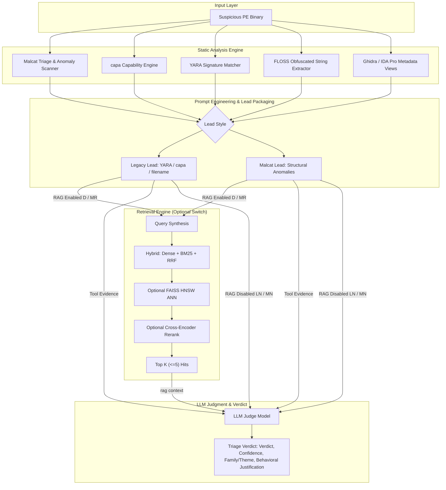
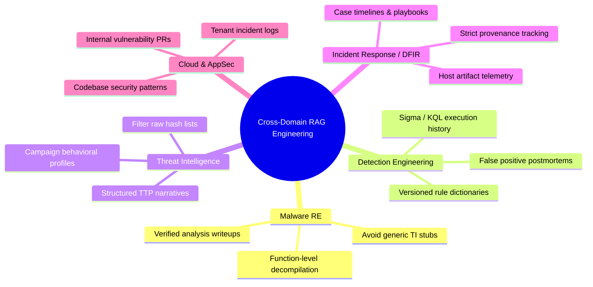

# RAG for Automated Malware Triage: Empirical Evaluation of Corpus Scaling, Local Embeddings, and Retrieval Contamination

**A Rigorous Empirical Benchmark of Retrieval-Augmented Generation across 16 Malware Samples, 4 Vector Configurations, and Controlled Tool-Only Ablations**

*Research Article & Technical Benchmark Report*  
*CADRE Architecture & Security Research*  

**Supporting data (tables, coverage, contamination detail):** [`BENCHMARK-REPORT-PUBLIC.md`](BENCHMARK-REPORT-PUBLIC.md)

---

## Executive Summary & Key Findings

Security engineering teams increasingly integrate Large Language Models (LLMs) into automated triage pipelines to accelerate malware reverse engineering (RE), incident response (IR), and security operations center (SOC) workflows. However, off-the-shelf LLMs routinely struggle with precise domain facts: without grounded evidence, they hallucinate malware family names, confuse build signatures, and misattribute techniques with high confidence.

Retrieval-Augmented Generation (RAG) is widely deployed as the industry standard to ground model outputs in private document stores. Yet, security research rarely evaluates RAG within a **true end-to-end malware triage loop** where rich static disassembler outputs compete directly with retrieved external text.

In this study, we conducted a systematic empirical evaluation of RAG within an automated malware triage architecture across two independent experimental axes:

1. **Axis 1 (Model × Corpus Scale):** Evaluating four vector search configurations (**Configs A, B, C, D**) varying corpus scale from **35,302 to 483,800 text chunks** and embedding models between **BAAI `bge-m3`** and **`Qwen3-0.6B`**.
2. **Axis 2 (Tool Lead Packaging × RAG Switch):** Evaluating a complete 2×2 factorial matrix across 16 real-world Windows malware binaries, isolating **Legacy vs. Malcat-first lead packaging** against **RAG ON vs. RAG OFF** (**Configs D, LN, MR, MN**).

```
                      +-------------------------------------------------------+
                      |                 EXECUTIVE TAKEAWAY                    |
                      | High-fidelity static tool packaging (Malcat lead)     |
                      | drives triage quality more than external retrieval.   |
                      | Un-shaped corpus expansion dilutes signal, while      |
                      | retrieved text and rule titles pollute LLM claims.    |
                      +-------------------------------------------------------+
```

### Key Empirical Findings

1. **Tool Evidence Packaging Dominates Retrieval:** On the frozen Qwen3 × 35K stack (Axis 2, n=16), **Malcat-first packaging without RAG (MN)** matched or beat **Malcat + RAG (MR)** on several hard / out-of-KB samples (e.g. S2, S4), and beat **legacy lead without RAG (LN)** on property usefulness. In-KB samples (S6–S10) were largely ties across cells. Packaging quality—not RAG alone—drove the useful differences.
2. **The Corpus Scaling Paradox:** Expanding the private knowledge base from 35,302 to 483,800 chunks with identical `bge-m3` plumbing (**A→B**) did **not** uniformly improve family/theme usefulness. On niche samples, larger corpora diluted retrieval density with generic threat-intelligence / encyclopedia stubs.
3. **Local Embedding Models Form a Peer Race:** Swapping embedding and reranking models between `BAAI/bge-m3` (+ `bge-reranker-v2-m3`) and `Qwen/Qwen3-Embedding-0.6B` (+ `Qwen3-Reranker-0.6B`) produced no reliable quality win for analyst-facing labels (**A↔D**, **B↔C**). Index membership and content shape dominate model brand.
4. **Contamination Failure Modes Identified:**
   - *RAG passage contamination (pilot):* On a two-sample Malcat-first RAG pilot (**Config E**, A2/S2 only), capa-rule prose mentioning PlugX led the judge to emit **PlugX** for S2 despite zero tool evidence for PlugX.
   - *YARA / rule-title contamination (n=16):* Under **LN** (legacy lead, RAG off), S2 was labeled **APT29/Cozy Bear** from rule id `CADRE_APT29_CozyBear_Generic`; smoke B2/C2 emitted **Cadre / CADRE ransomware** from lab rule/tool branding.
5. **Knowledge Base Membership Dominates Baseline Scores:** Samples whose SHA was present in the index (**S6–S10**) reached high agreement on family/theme across Axis-2 cells (S8 varies WannaCry vs MS17-010 wording). That is largely membership / self-hit, not proof of generalization to unseen threats.
6. **Property-Graded Evaluation is Mandatory:** Rigid string-matching against public vendor family labels fails when binaries are absent from the index (S2 VT≈Salgorea, not indexed). Grade **behavioral and structural properties** (e.g. process hollowing, RC4, MinGW) instead.

---

## 1. System Architecture & Triage Flow

To isolate the impact of RAG on reverse-engineering triage, we built a controlled evaluation harness called the **Thin Spine**. The thin spine executes static analysis tools, packages evidence, optionally executes hybrid vector retrieval, and passes the resulting context to an LLM judge for automated triage—stopping prior to long-running deep-dive decompilation or report synthesis.

### 1.1 End-to-End Triage Dataflow



Core retrieval path when RAG is enabled: **dense + BM25 fused with RRF**, top-*k* ≤ 5. FAISS HNSW ANN and the cross-encoder reranker are optional refinements, not required for every Axis-1/2 cell.

### 1.2 Tool Suite Specification & Prompt Packaging

The static analysis engine extracts ground-truth features directly from PE headers, section entropy tables, disassembly structures, and import tables:

| Analysis Tool | Target Artifacts & Attributes | Role in LLM Context |
| :--- | :--- | :--- |
| **Malcat** | Section entropy, anomaly heuristics, compiler identification, obfuscation flags | Primary static structural signals and execution anomalies |
| **capa** | ATT&CK technique IDs, low-level capability rules, API call patterns | Behavioral capability taxonomy (e.g., process injection, crypto) |
| **YARA** | Signature matches, heuristic rule names, malware family pattern triggers | Pattern matching and heuristic classification |
| **FLOSS** | Decoded stackstrings, tight-loop obfuscated strings, HTTP user-agents | Embedded indicators of compromise (IOCs) and commands |
| **Ghidra / IDA** | Function count, import/export tables, CFG complexity metrics | Binary architecture, library linkage, and structural complexity |

---

## 2. Experimental Setup & Controlled Ablations

The benchmark suite is organized into two independent evaluation axes to separate retrieval model mechanics from prompt packaging techniques.

### 2.1 Axis 1: Model × Corpus Scale (Legacy RAG Query)

Axis 1 holds the retrieval query style fixed (Legacy YARA/capa/filename) and evaluates a 2×2 factorial matrix of **Corpus Scale** vs. **Embedding / Reranking Stack**:

| Config | Corpus Chunks | Dense Embedding Model | Cross-Encoder Reranker | Retrieval Index Architecture | Isolation Target |
| :---: | :---: | :--- | :--- | :--- | :--- |
| **A** | **35,302** | `BAAI/bge-m3` | `BAAI/bge-reranker-v2-m3` | HNSW + BM25 | Baseline small corpus with `bge-m3` |
| **B** | **483,800** | `BAAI/bge-m3` | `BAAI/bge-reranker-v2-m3` | FAISS HNSW + BM25 + RRF | Impact of 13.7× corpus expansion (fixed models) |
| **C** | **483,800** | `Qwen/Qwen3-Embedding-0.6B` | `Qwen/Qwen3-Reranker-0.6B` | FAISS HNSW + BM25 + RRF | Impact of model swap to Qwen3 (fixed 483K corpus) |
| **D** | **35,302** | `Qwen/Qwen3-Embedding-0.6B` | `Qwen/Qwen3-Reranker-0.6B` | Qwen3 Dense on ID-matched 35K text | Model swap on small corpus (**Baseline Stack**) |

### 2.2 Axis 2: Tool Lead Packaging × RAG Switch

Axis 2 holds the vector stack fixed (**Config D: Qwen3 × 35K**) and evaluates a complete 2×2 factorial matrix across **all 16 binaries**, measuring the impact of **Lead Packaging** (Legacy vs. Malcat-first) and **External RAG** (ON vs. OFF):

```
                                  EXTERNAL RAG ON           EXTERNAL RAG OFF
                           +--------------------------+--------------------------+
  Legacy Lead Packaging    |       Config D           |       Config LN          |
  (YARA / capa / filename) |  (Legacy + RAG, 16/16)   |  (Legacy + No-RAG, 16/16)|
                           +--------------------------+--------------------------+
  Malcat Lead Packaging    |       Config MR          |       Config MN          |
  (Structural Anomalies)   |  (Malcat + RAG, 16/16)   |  (Malcat + No-RAG, 16/16)|
                           +--------------------------+--------------------------+
```

### 2.3 Dataset Composition & Sample Categories

The benchmark suite evaluates **16 unique Portable Executable (PE) binaries** categorized into four functional evaluation roles:

| Category | Sample Role IDs | Count | Role Definition & Intent | Evaluation Scoring Lens |
| :--- | :--- | :---: | :--- | :--- |
| **Smoke** | `smoke_A_1` … `smoke_C_2` | 6 | Pipeline regression and sanity validation set. | Pipeline completion and triage usability. |
| **Official** | `official_S1` … `official_S3` | 3 | Complex, obfuscated real-world PE malware (>1 MiB). | Behavioral and structural property extraction. |
| **Normal** | `normal_S4` … `normal_S5` | 2 | Real-world malware **absent** from the RAG index. | Generalization capability without self-hits. |
| **Corpus** | `corpus_S6` … `corpus_S10` | 5 | Malware samples **indexed** in the knowledge base. | In-KB lookup fidelity and memory retrieval. |

**Coverage notes (honest limits):** Config **A** ran S1–S10 plus smoke A1/A2; smoke B1/B2/C1/C2 were carried forward from later letters, not re-run under A. Axis 2 cells **D / LN / MR / MN** are each full **16/16**. **Config E** (Malcat-first RAG on bge×35K) is a **two-sample pilot (A2/S2 only)**—cited for contamination / property anecdotes, not as an n=16 peer cell.

---

## 3. Empirical Benchmark Results

### 3.1 Axis 1 Scoreboard: Corpus Scale & Model Swap (S1–S3)

Listed Axis-1 RAG runs completed successfully; when RAG was active these official runs returned the configured top-*k* of **5** retrieval hits.

| Sample Slot | Cryptographic SHA12 | Config A (`bge` × 35K) | Config B (`bge` × 483K) | Config C (`Qwen` × 483K) | Config D (`Qwen` × 35K) | Property-Graded Evaluation & Ground Truth |
| :--- | :--- | :--- | :--- | :--- | :--- | :--- |
| **S1** | `2df0d15147f7` | Unknown (VMProtect-packed trojan) | **VMProtect-packed** | **VMProtect-packed** | Unknown VMProtect-packed Trojan | **Consensus Winner (All):** Identifies VMProtect packer & trojan execution profile correctly. |
| **S2** | `39d60466fcbc` | **HiAsm** *(stochastic stub hit)* | Trojan.Win32.Agent | MSUpdaterTrojan | Packed trojan / Neshta-like | **Ground Truth:** VirusTotal consensus indicates Salgorea-class. *Salgorea is not in the index.* **Config B** gives the best property read. |
| **S3** | `c8c17fe61ee1` | **FuTurAx** | **FuTurAx** | Win32/Futurax | **Futurax** | **Tie (All):** Complete consensus on FuTurAx malware family. |

#### Axis 1 Execution Latency Breakdown (Wall-Clock Seconds)

| Sample Slot | Config A Latency | Config B Latency | Config C Latency | Config D Latency | Operational Reading |
| :---: | :---: | :---: | :---: | :---: | :--- |
| **S1** | 263 s | 339 s | 319 s | **258 s** | Wall-clock latency (2–7 minutes) is dominated by static tool execution & LLM generation, not dense vector search. |
| **S2** | 153 s | 247 s | 222 s | **140 s** |
| **S3** | 126 s | 238 s | 204 s | **103 s** |

---

### 3.2 Axis 2 Complete 16-Sample Scoreboard (D / LN / MR / MN)

Evaluating the complete 2×2 factorial matrix across all 16 malware binaries on the baseline stack:

| Sample Category | Sample ID | SHA12 | Config D (Legacy + RAG) | Config LN (Legacy + No-RAG) | Config MR (Malcat + RAG) | Config MN (Malcat + No-RAG) | Comparative Triage Quality & Analyst Utility |
| :--- | :--- | :--- | :--- | :--- | :--- | :--- | :--- |
| **Smoke** | `smoke_A_1` | `d164c1d5c03a` | Trojan.Dropper (Adobe) | FlashUpdateDropper | FakeAdobeFlashDropper | FakeFlash Dropper | **Tie:** All extract Flash dropper theme. |
| **Smoke** | `smoke_A_2` | `d27bc752e43c` | Win32.Neshta variant | Generic process-hollowing trojan/dropper | process_hollower | Unknown Process Hollowing Trojan/Dropper | **LN / MR / MN:** recover hollowing; **D** invents Neshta. |
| **Smoke** | `smoke_B_1` | `36c60de86d02` | Trojan.VB.Downloader | Trojan.VB.Generic | VB6 trojan / TJprojMain | **TrojanDownloader.VB** | **MN Winner:** Crispest downloader attribution. |
| **Smoke** | `smoke_B_2` | `dcd93bfb6b29` | unknown | **Cadre ransomware** *(lab rule bleed)* | Unknown UPX Borland trojan | Delphi trojan (svc + enc) | **LN Failure:** invents lab-branded “Cadre ransomware”; MR/MN stay generic. |
| **Smoke** | `smoke_C_1` | `fa8b270f1972` | **Kawaii-Unicorn** | *none* (verdict benign) | Kawaii-Unicorn | Unicorn | **LN Miss:** legacy+no-RAG weakest; D/MR/MN recover Unicorn theme. MN also succeeds with RAG off—so the miss is packaging, not “RAG required.” |
| **Smoke** | `smoke_C_2` | `b73782c34103` | Unknown UPX-packed trojan | **CADRE ransomware** *(lab rule bleed)* | Generic UPX-packed | UPX-packed trojan/loader | **LN Failure:** invents “CADRE ransomware” from lab rule/tool text. |
| **Official** | `official_S1`| `2df0d15147f7` | VMProtect-packed Trojan | Generic Infostealer (VMProtect) | VMProtect packed malware | VMProtect (poss. Emotet) | Packer-level consensus; MN adds Emotet guess. |
| **Official** | `official_S2`| `39d60466fcbc` | Packed trojan / Neshta | **APT29/Cozy Bear** *(Rule hallucination)* | Generic trojan | **Remcos Loader** | **MN Winner:** MN identifies Remcos loader behavior; LN suffers severe APT29 rule-title contamination. |
| **Official** | `official_S3`| `c8c17fe61ee1` | Futurax | FuTuRaX | FuTurAx | FuTuRaX | **Tie:** Complete family agreement across all 4 cells. |
| **Normal** | `normal_S4` | `426511145595` | Generic dropper | Keylogger | None *(RAG Dilution)* | **Mailslot / Delphi Trojan** | **MN Winner:** MN extracts Delphi mailslot backdoor; MR RAG yields "None". |
| **Normal** | `normal_S5` | `353ddce78d58` | Go-based crypto miner | Go-based Trojan | Unknown Go dropper | Go-based trojan | **Tie:** All identify Go runtime execution environment. |
| **Corpus** | `corpus_S6` | `91d57a66876b` | **XWorm** | **XWorm** | **XWorm** | **XWorm** | **Tie:** In-KB agreement. |
| **Corpus** | `corpus_S7` | `7fc9ae64edb1` | HEUR-Trojan-Ransom… | Generic ransomware | Generic Ransomware / BootLocker | Generic ransomware | **Tie-ish:** ransom theme; wording varies. |
| **Corpus** | `corpus_S8` | `980373db2260` | MS17-010 Exploit Loader… | **WannaCry** | MS17-010 / EternalBlue | Exploit.Win32.MS17-010 | **Theme tie, not identical strings:** LN names campaign; others name exploit ID. |
| **Corpus** | `corpus_S9` | `1c2e8be7a102` | Trojan.MSIL.Kryplod | **Kryplod** | **Kryplod** | **Kryplod** | **Tie:** In-KB Kryplod theme. |
| **Corpus** | `corpus_S10`| `4b9b8edaed36` | **CoreWarrior** | Flooder.Win32.CoreWarrior | **CoreWarrior** | **CoreWarrior** | **Tie:** In-KB CoreWarrior theme. |

```
  Property-lens utility on frozen stack D (not a formal F1 ranking)

  Stronger ──►  MN  Malcat-first, RAG off
                MR  Malcat-first, RAG on     (≈ MN on in-KB; MN often better on hard/OOD)
                D   Legacy + RAG             (mixed; can invent Neshta-class names)
  Weaker   ──►  LN  Legacy, RAG off          (APT29 / Cadre-ransomware contamination; C1 miss)
```

---

## 4. Deep-Dive Technical Analysis & Failure Modes

### 4.1 The Property-Graded Evaluation Framework

Traditional machine learning benchmarks evaluate classification models via rigid string accuracy against ground-truth labels. In real-world reverse engineering, this methodology is fundamentally broken when binaries are absent from the training set or index.

Consider Sample **A2 (`d27bc752e43c`)** and Sample **S2 (`39d60466fcbc`)**:

```
+-----------------------------------------------------------------------------------+
|                     SAMPLE A2 PROPERTY-GRADED ANALYSIS                            |
+-----------------------------------------------------------------------------------+
|  Useful property target: process hollowing / injector + RC4 (+ MinGW when stated).|
|  No crisp public family in VT/MB for this SHA.                                    |
+-----------------------------------------------------------------------------------+
|  A (freeze):   HiAsm lottery / unstable                                           |
|  B:            Virut-like                                                         |
|  C:            Generic.ProcessHollowing.Dropper                                   |
|  D (n=16):     Win32.Neshta variant          ← wrong named family                 |
|  E (pilot):    Process hollowing + RC4 (MinGW) ← strongest crisp property string  |
|  LN (n=16):    Generic process-hollowing trojan/dropper                           |
|  MN (n=16):    Unknown Process Hollowing Trojan/Dropper                           |
|  H (pilot):    Process Hollowing Dropper/Injector (RC4 payload)                   |
+-----------------------------------------------------------------------------------+
|  Reading: Malcat-led packaging recovers hollowing with or without RAG (MN / E/H). |
|  Do not equate MN's Axis-2 string with E's RC4/MinGW wording. D invents Neshta.   |
+-----------------------------------------------------------------------------------+
```

### 4.2 Architectural Failure Modes: Retrieval & Rule Contamination

Our experimental ablations uncovered two critical failure modes where AI context injection actively degraded triage quality:

```
                      +----------------------------------+
                      |    DUAL CONTAMINATION MODES      |
                      +----------------------------------+
                      |                                  |
                      |  1. RAG Passage Contamination    |
                      |     (S2 @ Config E -> "PlugX")   |
                      |                                  |
                      |  2. Rule Title Contamination     |
                      |     (S2 @ Config LN -> "APT29")  |
                      |                                  |
                      +----------------------------------+
```

#### Failure Mode 1: RAG Passage Contamination (The "PlugX" Effect)

**Coverage:** Config **E** only—Malcat-first RAG on LIVE bge×35K, **A2/S2 pilot (n=2)**, not an Axis-2 n=16 cell.

On **S2**, Malcat extracted static anomalies; hybrid retrieval returned five capa encyclopedia passages. One hit’s prose stated ADD/XOR/SUB encoding is *“common for PlugX, but is also utilized by other malware families…”* That string entered the RAG context; the LLM emitted **PlugX**. Static tools never asserted PlugX; the sample was not PlugX.

#### Failure Mode 2: Rule-Title Contamination (The "APT29" / lab-brand Effect)

**Coverage:** Config **LN**, full **n=16**, RAG off, legacy YARA/capa/filename lead.

On **official_S2**, the prompt included YARA rule id `CADRE_APT29_CozyBear_Generic`. The judge emitted **APT29 / Cozy Bear**. On the same SHA, **MN** produced Remcos Loader (still not Salgorea, but not nation-state-from-title).

Separately, **smoke_B_2** → **Cadre ransomware** and **smoke_C_2** → **CADRE ransomware**: lab rule/tool branding promoted into a fake family. MR/MN stayed in generic UPX/Delphi/trojan language.

> [!CAUTION]
> **Prompt Hygiene Imperative:** LLM judges must be explicitly instructed via system prompts to treat RAG passage text and YARA rule identifiers as *untrusted reference strings*, prohibiting the model from asserting family attributions unless backed by primary binary evidence.

---

### 4.3 Repeatability & Stochasticity Audit

To verify whether headline family strings were deterministic properties of vector configurations, we executed a repeatability trial: running **Config A** (`bge-m3` × 35K) on Samples **A2** and **S2** three consecutive times under identical environment conditions.

```
       +----------------------------------------------------------------------+
       |               CONFIG A REPEATABILITY AUDIT (3 RUNS)                  |
       +----------------------------------------------------------------------+
       |  Run  | Sample A2 (Smoke)               | Sample S2 (Official)       |
       +-------+---------------------------------+----------------------------+
       |   1   | Process Hollowing Dropper       | HiAsm (low confidence)     |
       |   2   | Unknown                         | (null family)              |
       |   3   | Process Hollowing (poss. HiAsm) | HiAsm (crisp 0.85 score)   |
       +----------------------------------------------------------------------+
       |  RETRIEVAL: Top-5 chunk IDs and vector similarity scores were         |
       |             100% IDENTICAL across all three runs.                    |
       |  LLM JUDGE: Outputted fluctuating family strings across runs.        |
       +----------------------------------------------------------------------+
```

**Takeaway:** Vector retrieval is deterministic; LLM judgment over thin evidence is stochastic. "Config A wins HiAsm" was an artifact of stochastic judge sampling over an ungrounded 2014 encyclopedia stub (`W32/HiAsm.A!tr`), not a stable system property.

---

## 5. Cross-Domain Security Engineering Guidelines

The findings from this reverse-engineering benchmark extend directly to adjacent cybersecurity engineering domains:



### Strategic System Design Principles

1. **Prioritize Tool Feature Extraction Over Search:** Invest engineering effort into extracting high-fidelity, structured features from primary systems (e.g., disassemblers, SIEM query APIs, cloud audit logs) before deploying RAG.
2. **Curate Domain-Shaped Knowledge Bases:** Avoid populating RAG vector databases with raw threat intelligence feeds, hash dumps, or generic rule definitions. Index high-value, domain-specific text (e.g., decompiled function analysis, postmortem reports, verified threat writeups).
3. **Enforce Attribution Provenance:** Implement strict system prompt boundaries preventing the LLM from promoting secondary text mentions (RAG prose, rule titles) into primary verdict classifications.

---

## 6. The Way Forward: Industry Guidance & Strategic Blueprint for AI-Assisted Reverse Engineering

As AI capabilities mature, the cybersecurity industry stands at a critical juncture regarding how Large Language Models should be integrated into malware analysis and threat hunting workflows. Our empirical findings challenge several prevailing industry assumptions about RAG, vector scaling, and prompt design. Below, we outline strategic recommendations for security leaders, AI engineers, and tool developers building the next generation of AI-assisted security automation.

```
       +----------------------------------------------------------------------+
       |             THE WAY FORWARD: THREE STRATEGIC PILLARS                 |
       +----------------------------------------------------------------------+
       |                                                                      |
       |  1. DEEP STATIC ANALYSIS PACKAGING BEFORE RAG SEARCH                 |
       |     Structured disassembler & static tool features drive LLM         |
       |     accuracy more than external document lookup.                     |
       |                                                                      |
       |  2. PURPOSE-BUILT RE-PRIMARY KNOWLEDGE BASES                         |
       |     Replace generic TI feeds and raw hash dumps with decompiled      |
       |     pseudo-code corpora and verified analyst postmortems.            |
       |                                                                      |
       |  3. PROMPT PROVENANCE & STRICT ATTRIBUTION GUARDRAILS               |
       |     Treat RAG passages and rule titles as untrusted reference        |
       |     strings to eliminate hallucinated family classifications.        |
       |                                                                      |
       +----------------------------------------------------------------------+
```

### 6.1 Pillar 1: Deep Tool Packaging Beats Shallow Retrieval

A common pattern is wrapping LLMs around shallow file metadata and relying on RAG to supply missing domain context. In this benchmark, **retrieval did not compensate for weak tool packaging**: legacy lead + RAG off (**LN**) still produced contaminated or empty family strings, while Malcat-first tools-only (**MN**) recovered usable behavior on the same SHAs.

- **Recommendation:** Prioritize deep, deterministic static feature extraction—**Malcat**, **capa**, **FLOSS**, **Ghidra/IDA** metadata—before investing in larger vector stores.
- **Outcome observed here:** Clean Malcat-first packaging (**MN**) often matched or beat Malcat+RAG (**MR**) on hard/out-of-KB samples *without* external document lookup.

### 6.2 Pillar 2: Evolving from Generic Document Stores to RE-Primary Corpora

The assumption that *"bigger vector databases yield smarter triage"* did not hold on our Axis-1 runs. Growing from **35,302 to 483,800** chunks with the same `bge-m3` stack did not uniformly improve labels; generic TI / encyclopedia / rule-shaped text diluted niche hits (the *Corpus Scaling Paradox* in this study).

- **The Way Forward:** Vector databases for reverse engineering must transition from generic text dumps to **RE-Primary Knowledge Bases**.
- **What RE-Primary Knowledge Looks Like:**
  1. **Function-Level Decompilation Corpora:** Indexing normalized pseudo-code, call graphs, and structural control-flow representations of common malware algorithms (e.g., specific custom RC4 implementations, domain generation algorithms, process injection routines).
  2. **Verified Analyst Writeups:** Indexing deep-dive technical reports written by senior human reverse engineers, containing verified structural analysis rather than automated string scrapes.
  3. **Symbolic & Semantic Annotations:** Linking vector embeddings to verified control-flow graphs (CFGs) and Ghidra/IDA symbol tables.

### 6.3 Pillar 3: Strict Prompt Provenance & Attribution Hygiene

**RAG passage contamination** (PlugX on pilot E @ S2) and **rule-title contamination** (APT29 and Cadre/CADRE ransomware on LN ×16) show the same underlying risk: LLMs promote named entities from secondary context—retrieved prose or rule identifiers—even when primary tool evidence does not support them.

- **Recommendation:** AI security architects must enforce strict provenance boundaries in prompt templates:
  - System prompts must explicitly segregate **Primary Evidence** (facts extracted directly from the target binary) from **Secondary Reference Text** (retrieved RAG passages and heuristic rule titles).
  - Prompts must include strict negative constraints: *"Do not output a malware family or threat actor attribution unless it is supported by primary static tool evidence. Treat rule names and retrieved document titles strictly as background context, not ground truth."*

### 6.4 Summary for Industry Implementation

| Security Automation Layer | Current Industry Anti-Pattern | The Way Forward (Research Recommendation) |
| :--- | :--- | :--- |
| **Context Assembly** | Shallow file metadata + heavy RAG lookup | **Deep static tool packaging** (Malcat + capa + Ghidra/IDA SQL features) |
| **Knowledge Base Curation** | Indexing millions of raw TI reports & hash dumps | **Curating RE-primary corpora** (decompiled C pseudo-code & verified analyst writeups) |
| **Vector Selection** | Constant swapping of embedding models | **Fixing the corpus signal-to-noise ratio** (model selection is secondary to content quality) |
| **Attribution Logic** | Allowing LLMs to cite RAG text or rule titles | **Enforcing strict provenance guardrails** (prohibiting secondary text attribution) |
| **Evaluation Metrics** | String matching against vendor family names | **Property-graded behavioral evaluation** (scoring process injection, crypto, build traits) |

---

## 7. Conclusions

On this knowledge base and thin triage path:

1. **Axis 1:** Neither 13.7× corpus growth nor bge↔Qwen swaps reliably improved RE family/theme labels.  
2. **Axis 2 (n=16 on stack D):** Malcat-first packaging (**MN / MR**) was more useful than legacy packaging without RAG (**LN**) on several hard/OOD cases; hybrid RAG under Malcat (**MR**) was not a systematic win over tools-only Malcat (**MN**).  
3. **Contamination:** RAG prose can inject collateral families (PlugX @ pilot E); YARA/lab titles contaminate even with RAG off (**APT29**, **Cadre/CADRE ransomware** @ LN).  
4. **In-KB samples** largely agree across cells—membership helps recognition, not OOD generalization.

Recommended posture: prioritize deep static-tool packaging; keep hybrid RAG opt-in until an RE-shaped corpus is built and re-measured; enforce provenance so RAG hits and rule titles cannot become family verdicts without primary binary evidence.

**Appendix / supporting data:** Full configuration definitions, SHA-12 correlation tables, latency figures, repeatability audit, and contamination case inventory are in [`BENCHMARK-REPORT-PUBLIC.md`](BENCHMARK-REPORT-PUBLIC.md) (no lab filesystem or host internals).

---

*CADRE Platform & Security Architecture Research · Licensed under MIT / Apache 2.0 · 2026*
